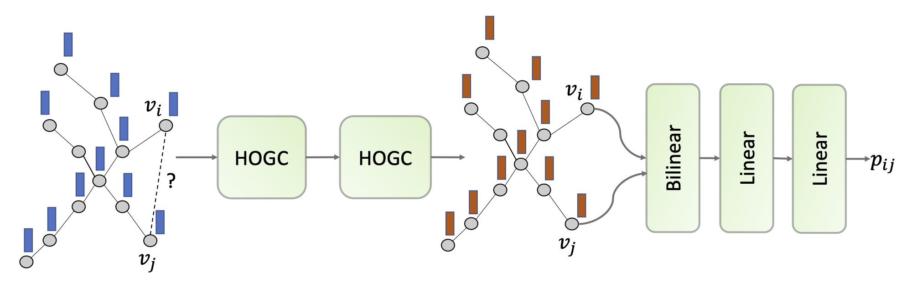

# Higher-Order Graph Convolutional Networks for Link Prediction
A PyTorch implementation of `Predicting Biomedical Interactions with
Higher-Order Graph Convolutional Networks (HOGCN)`.
### Block diagram



### Requirements
The codebase is implemented in Python 3.6.9 and the packages used for developments are mentioned below.

```
argparse                1.1
numpy                   1.19.1
torch                   1.5.0
torch_sparse            0.6.4
pandas                  1.0.1
scikit-learn            0.22.1
matplotlib              3.2.2
scipy                   1.5.0
texttable               1.6.2
```

### Datasets
The details about dataset used in the experiments are provided in [README](data/README.md).

### Training options
<p align="justify">
Training an N-GCN/MixHop model is handled by the `src/main.py` script which provides the following command line arguments.</p>

#### Input and output options
```
  --network_type      STR    Type of interaction network     Default is `DTI`.
  --fold_id           INT    Run model on data fold          Default is 1.
```
#### Model options
```
  --seed              INT     Random seed.                   Default is 42.
  --epochs            INT     Number of training epochs.     Default is 50.
  --batch_size        INT     Number of samples in a batch   Default is 256.
  --early-stopping    INT     Early stopping rounds.         Default is 10.
  --learning-rate     FLOAT   Adam learning rate.            Default is 5e-4.
  --dropout           FLOAT   Dropout rate value.            Default is 0.1.
  --lambd             FLOAT   Regularization coefficient.    Default is 0.0005.
  --cut-off           FLOAT   Norm cut-off for pruning.      Default is 0.1.
  --budget            INT     Architecture neuron budget.    Default is 60.
  --order             INT     Order of neighbor including 0  Default is 4.
  --dimension         INT     Dimension of each adjacency    Default is 32.
  --layers-1          LST     Layer sizes (first).           Default is [32, 32, 32, 32]. 
  --layers-2          LST     Layer sizes (second).          Default is [32, 32, 32, 32].
  --hidden1           INT     Output of bilinear layer       Default is 64.
  --hidden2           INT     Output of last linear layer    Default is 32.
  --no-cuda           BOOL    Run on CPU                     Default is False.
  --fastmode          BOOL    Validate every epoch           Default is True
```

### Running HOGCN for biomedical interaction prediction  
- Train HOGCN with default parameters  

```train
python3 main.py 
```

- Train HOGCN on DTI network with order `3` and dimension `32` for each adjacency power

```train
python3 main.py --network_type 'DTI' --order 4 --dimension 32 
```

### Acknowledgement
The code is based on [MixHop](https://github.com/benedekrozemberczki/MixHop-and-N-GCN) and [SkipGNN](https://github.com/kexinhuang12345/SkipGNN).